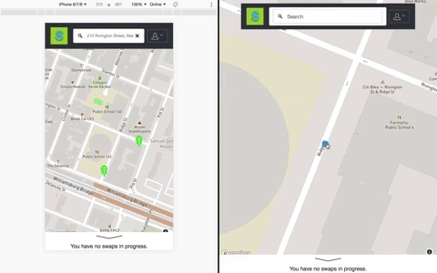
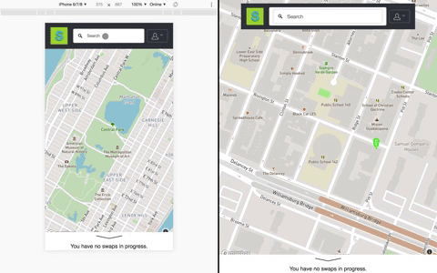
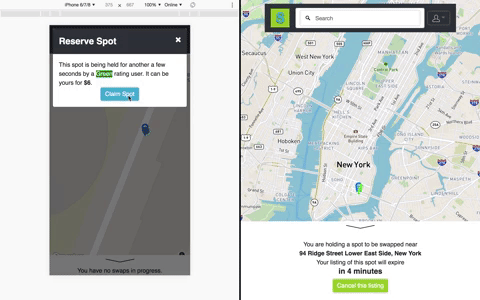
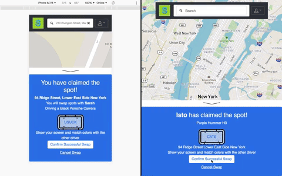
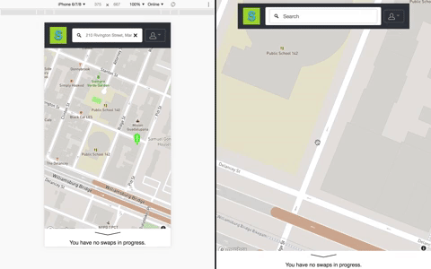

# Spot Swap
Ever wish you could be tipped off when someone was about to leave their parking spot?  Ever wished you could sell the information that you are about to leave your parking spot?   
Use **Spot Swap** to look for parking spots that are about to open up, or to exchange your current spot with other users!

## Table of Contents

1. [Usage](#Usage)
1. [Team](#team)
1. [Requirements](#requirements)
1. [Development](#development)
    1. [Installing Dependencies](#installing-dependencies)
    1. [Tasks](#tasks)
1. [Contributing](#contributing)

## Usage
Find us at **[spotswap.io](http://www.spotswap.io)**!

1. **Create a personal account to swap spots** - Log in and create an account to exchange spots with other users  

1. **List a spot that you are about to leave for a price** - If you are about to leave a parking spot, post it on the app and save it until another Spot Swapper comes to claim it.  Pick a price for which you will trade the spot, and designate how long you are willing to hold the spot.  

1. **Search for spots near your destination** - Use the location tracking or search features to find spots listed near your destination.  

1. **Claim a reserved spot** - When you need a spot, look for ones being saved by other Spot Swappers.  Select the spot to see for how much they'll swap it, and claim it to reserve that spot for yourself!  Once you've claimed the spot, both swappers will see each other's information.  Additionally, a matching color will paint your screen, which can help to identify your correct swap partner.  

1. **Swap the spot!** - Once you've found your spot, and succesfully swapped, confirm the swap to complete the transaction.  

1. **Pin and post open spots** - Even if you aren't holding the spot yourself, post open spots you see for the community!  



## Team
  - __Product Owner__: Milton Lopez
  - __Scrum Master__: Milton Lopez
  - __Development Team__: Trent Going, Sarah Gujadhur, Milton Lopez

## Requirements

- React 
    - react 16.5
    - react-dom 16.5
    - react-router 4.3
- Apollo
    - react-apollo 2.1
    - apollo-boost 0.1
    - apollo-link-context 1.0
    - apollo-link-ws 1.0
- GraphQL 
    - graphql-yoga 1.4
    - lokka 1.7
- Prisma 1.12
- Mapbox
    - mapbox-gl 0.49
    - mapbox-gl-geocoder 2.3
- Docker

## Development

### Installing Dependencies

From within the server directory:

```
npm install
npm start

```

From within the worker directory:

```
npm install
npm start

```

From within the web directory:

```
npm install
npm start

```
### Docker Containers
| Name             | Service | Container | Tech                 |
|------------------|---------|-----------|----------------------|
| Web              | Web     | web       | React, React-Router  |
| Spots API        | Spots   | spots     | Node, Express        |
| Spots DB         | Spots   | spots-db  | Postgres             |
| Swagger          | Spots   | swagger   | Swagger UI           |
| Users API        | Users   | users     | Node, Express GQL    |
| Users DB         | Users   | users-db  | Postgres             |
| Functional Tests | Test    | n/a       | TestCafe             |

### Roadmap

View the project roadmap [here](https://waffle.io/spot-swap/spot-app)


## Contributing

See [CONTRIBUTING.md](CONTRIBUTING.md) for contribution guidelines.